# 💳 PayFlow — Банківська Платіжна Система


> Навчальний веб-застосунок що імітує банківську платіжну систему з повним
> циклом управління фінансами. Розроблено в рамках навчальної практики.

---

## ✨ Можливості

| 👤 Клієнт | 👔 Менеджер | 🛡️ Адміністратор |
|-----------|-------------|-------------------|
| 📝 Реєстрація та вхід у систему | 🔐 Окремий портал входу `/manager/login` | 🔐 Окремий портал входу `/admin/login` |
| 📊 Особистий dashboard зі статистикою | 📈 Панель з операційною статистикою | 📊 Системна панель зі статистикою |
| 🏦 Відкриття банківських рахунків | 📋 Перегляд усіх транзакцій системи | 👥 Управління користувачами (CRUD, ролі) |
| 💳 Додавання та видалення карток | 📑 Формування звітів | 🚫 Блокування / розблокування користувачів |
| 🔒 Зміна PIN-коду картки | | ✅ Підтвердження транзакцій |
| 💰 Встановлення лімітів витрат | | ❌ Відхилення / скасування платежів |
| 🛡️ Блокування / розблокування карток | | 💸 Повернення коштів (refund) |
| 💸 Здійснення платежів | | 📑 Системні звіти |
| 🔄 Перекази між рахунками | | ⚙️ Системні налаштування |
| ➕ Поповнення рахунків | | 👤 Зміна власного профілю та паролю |
| 📜 Історія транзакцій з пагінацією | | |
| ❎ Скасування платежів у статусі pending | | |
| ⚙️ Зміна профілю та паролю | | |

---

## 🛠️ Технічний стек

- **🖥️ Backend:** Spring Boot 4.0.2, Java 17, Spring Security, Spring Data JPA / Hibernate, Jakarta Persistence 3.2.0
- **🎨 Frontend:** FreeMarker (`spring-boot-starter-freemarker` + `freemarker-java8` 2.1.0), Bootstrap 5, Chart.js
- **🗄️ Database:** MySQL 8.x (`mysql-connector-j`)
- **🔐 Security:** BCrypt password hashing, Session-based auth, Brute-force protection (`LoginAttemptService`)
- **📝 Logging:** SLF4J + Logback (`payflow.log` + `security.log`, з ротацією та gzip-стисненням)
- **🧪 Testing:** JUnit 5 + Mockito + Spring Boot Test (**97 тестів**)
- **🛠️ Build:** Maven, Lombok 1.18.42, Spring Boot DevTools

---

## 🚀 Швидкий старт

### 📋 Вимоги

- ☕ **Java 17+**
- 📦 **Maven 3.8+**
- 🐬 **MySQL 8.x**

### ⚙️ Встановлення

#### 1️⃣ Клонувати репозиторій
```bash
git clone https://github.com/zivak0707-lang/Course-2026-np.git
cd Course-2026-np
```

#### 2️⃣ Створити базу даних MySQL
```sql
CREATE DATABASE `course-2026-np`
  CHARACTER SET utf8mb4
  COLLATE utf8mb4_unicode_ci;
```

#### 3️⃣ Налаштувати `application.properties`
Відкрийте `src/main/resources/application.properties` і встановіть пароль root-користувача MySQL — замініть placeholder `YOUR_MYSQL_PASSWORD` на ваш реальний пароль:
```properties
spring.datasource.username=root
spring.datasource.password=YOUR_MYSQL_PASSWORD
spring.datasource.url=jdbc:mysql://localhost:3306/course-2026-np
```
> 💡 Чистий шаблон конфігурації знаходиться у файлі `src/main/resources/application.properties.example`.

Схема БД генерується автоматично через `spring.jpa.hibernate.ddl-auto=update`.

#### 4️⃣ Запустити застосунок
```bash
mvn spring-boot:run
```
Або за допомогою Maven Wrapper:
```bash
./mvnw spring-boot:run        # Linux / macOS
mvnw.cmd spring-boot:run      # Windows
```

#### 5️⃣ Відкрити у браузері
🌐 **http://localhost:8080**

---

## 🔑 Тестові акаунти

| 🎭 Роль | 📧 Email | 🔒 Пароль | 📝 Опис |
|---------|----------|-----------|---------|
| 🛡️ **Admin** | `admin@payflow.com` | `admin123` | Повний доступ до системи, керування користувачами та транзакціями |
| 👔 **Manager** | `manager@payflow.com` | `manager123` | Перегляд усіх транзакцій та формування звітів |
| 👤 **Client** | `client@payflow.com` | `client123` | Звичайний клієнт — рахунки, картки, платежі |

> ✅ **Створюються автоматично при першому запуску** через `DataInitializer`.
> Паролі зберігаються у вигляді BCrypt-хешів.

---

## 📁 Структура проєкту

```
📦 course-2026-np
├── 📄 pom.xml                          # Maven конфігурація + залежності
├── 📄 README.md                        # Документація проєкту
├── 📄 mvnw / mvnw.cmd                  # Maven Wrapper (Linux/Windows)
│
└── 📂 src
    ├── 📂 main
    │   ├── 📂 java/ua/com/kisit/course2026np
    │   │   ├── ☕ Main.java              # Точка входу Spring Boot
    │   │   │
    │   │   ├── 📂 config                 # ⚙️ Конфігурація
    │   │   │   ├── DataInitializer.java     # Сід-юзери при старті
    │   │   │   └── WebConfig.java           # Web MVC налаштування
    │   │   │
    │   │   ├── 📂 controller             # 🎮 Контролери (REST + MVC)
    │   │   │   ├── HomeController           # / , /login , /register
    │   │   │   ├── ClientController         # /dashboard/**
    │   │   │   ├── ManagerController        # /manager/**
    │   │   │   ├── AdminController          # /admin/**
    │   │   │   ├── AccountController        # /api/accounts/**
    │   │   │   ├── CreditCardController     # /cards/**
    │   │   │   ├── PaymentController        # /api/payments/**
    │   │   │   ├── DashboardAccountController
    │   │   │   └── TestController           # /api/test/**
    │   │   │
    │   │   ├── 📂 dto                    # 📦 Data Transfer Objects
    │   │   │   ├── ChangePinRequest
    │   │   │   ├── DashboardStats
    │   │   │   ├── SpendingLimitRequest
    │   │   │   └── TransactionPage
    │   │   │
    │   │   ├── 📂 entity                 # 🗃️ JPA-сутності
    │   │   │   ├── User / UserRole
    │   │   │   ├── Account / AccountStatus
    │   │   │   ├── CreditCard
    │   │   │   └── Payment / PaymentStatus / PaymentType
    │   │   │
    │   │   ├── 📂 exception              # ⚠️ Глобальна обробка помилок
    │   │   │   └── GlobalExceptionHandler
    │   │   │
    │   │   ├── 📂 repository             # 💾 Spring Data JPA репозиторії
    │   │   │   ├── UserRepository
    │   │   │   ├── AccountRepository
    │   │   │   ├── CreditCardRepository
    │   │   │   └── PaymentRepository
    │   │   │
    │   │   ├── 📂 security               # 🔐 Spring Security
    │   │   │   └── SecurityConfig
    │   │   │
    │   │   ├── 📂 service                # 💼 Бізнес-логіка
    │   │   │   ├── UserService
    │   │   │   ├── AccountService
    │   │   │   ├── CreditCardService
    │   │   │   ├── PaymentService
    │   │   │   ├── DashboardService
    │   │   │   ├── LoginAttemptService      # Захист від брутфорсу
    │   │   │   ├── ManagerService
    │   │   │   └── AdminService
    │   │   │
    │   │   └── 📂 validation             # ✅ Кастомні валідатори
    │   │
    │   └── 📂 resources
    │       ├── 📄 application.properties           # Конфігурація
    │       ├── 📄 application.properties.example   # Шаблон для розробників
    │       ├── 📄 logback-spring.xml               # Налаштування логів
    │       ├── 📂 static                # CSS / JS / favicon
    │       └── 📂 templates             # 🎨 FreeMarker шаблони (.ftl)
    │           ├── 📂 admin                # admin/dashboard, users, transactions...
    │           ├── 📂 manager              # manager/dashboard, reports...
    │           └── 📂 client               # client/dashboard, cards, payment...
    │
    └── 📂 test/java/.../course2026np    # 🧪 Тести
        ├── Course2026NpApplicationTests       # Smoke-тест Spring контексту
        ├── 📂 entity                         # AccountTest, CreditCardTest,
        │                                     # PaymentTest, UserTest
        └── 📂 service                        # PaymentServiceTest,
                                              # TransferDebugTest
```

---

## 🧪 Тестування

Запуск усіх тестів:
```bash
mvn test
```

📊 У проєкті **97 тестів** у **7 тестових класах**:

| 📂 Тестовий клас | 🔢 Кількість | 📌 Що перевіряє |
|------------------|-------------|-----------------|
| `UserTest` | 13 | Валідація сутності користувача |
| `AccountTest` | 23 | Логіка рахунків та балансів |
| `CreditCardTest` | 19 | Картки, PIN, ліміти, термін дії |
| `PaymentTest` | 21 | Поведінка платежу |
| `PaymentServiceTest` | 15 | Сервіс платежів та переказів |
| `TransferDebugTest` | 5 | Сценарії переказів |
| `Course2026NpApplicationTests` | 1 | Smoke-тест контексту Spring |

---

## 📸 Скріншоти

Нижче представлено основні екрани застосунку — від публічної зони та
клієнтського інтерфейсу до адмін-панелі, панелі менеджера та системи
логування.

### 🌐 Публічна зона

Стартова сторінка, форма входу та реєстрація нових користувачів.

| 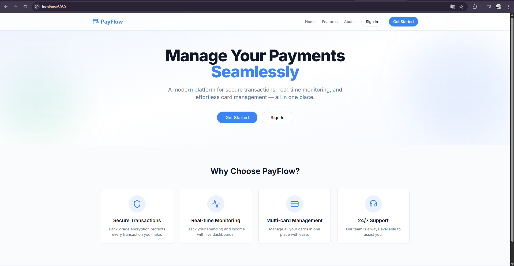 | 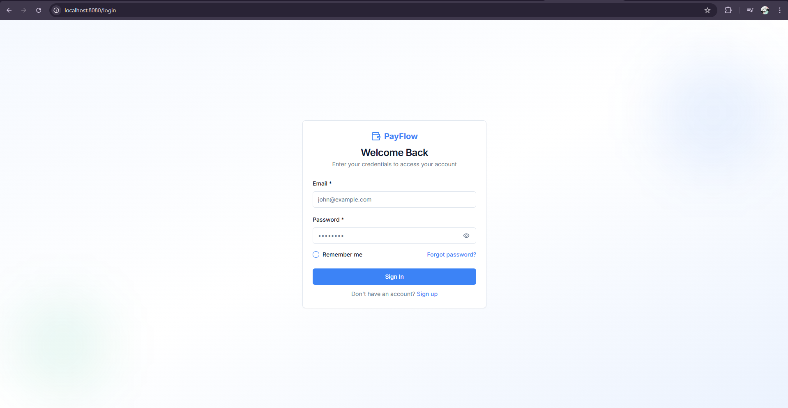 |
|:---:|:---:|
| **Головна сторінка** | **Форма входу** |

<p align="center">
  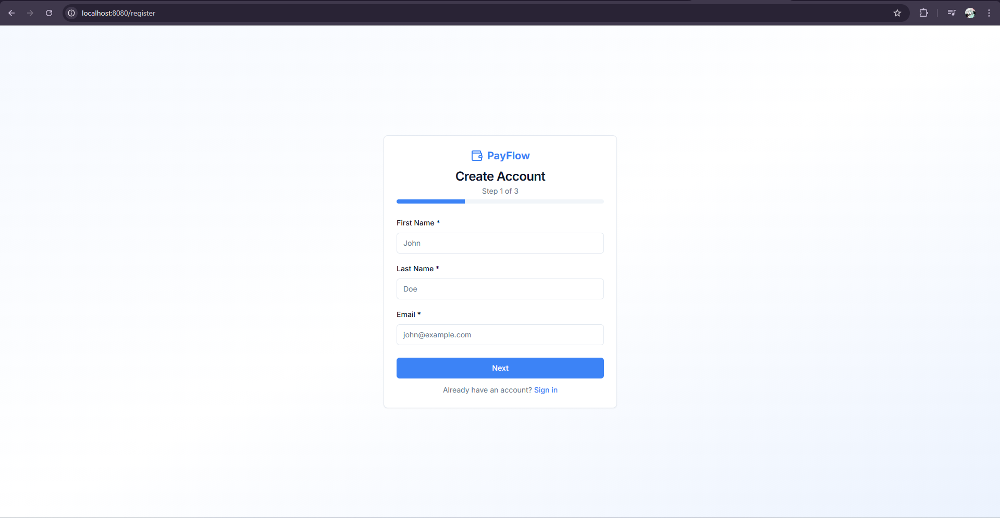
  <br/>
  <b>Форма реєстрації нового користувача</b>
</p>

---

### 👤 Клієнтська частина

Особистий dashboard, управління картками й рахунками, здійснення платежів та історія транзакцій.

| 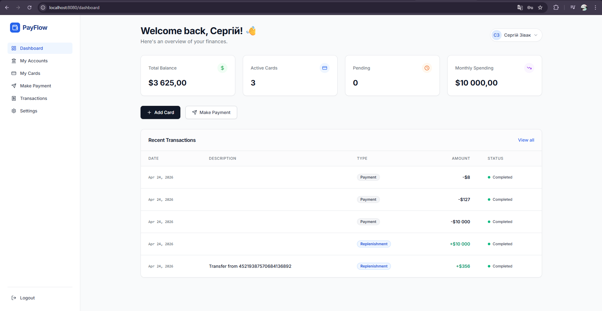 | 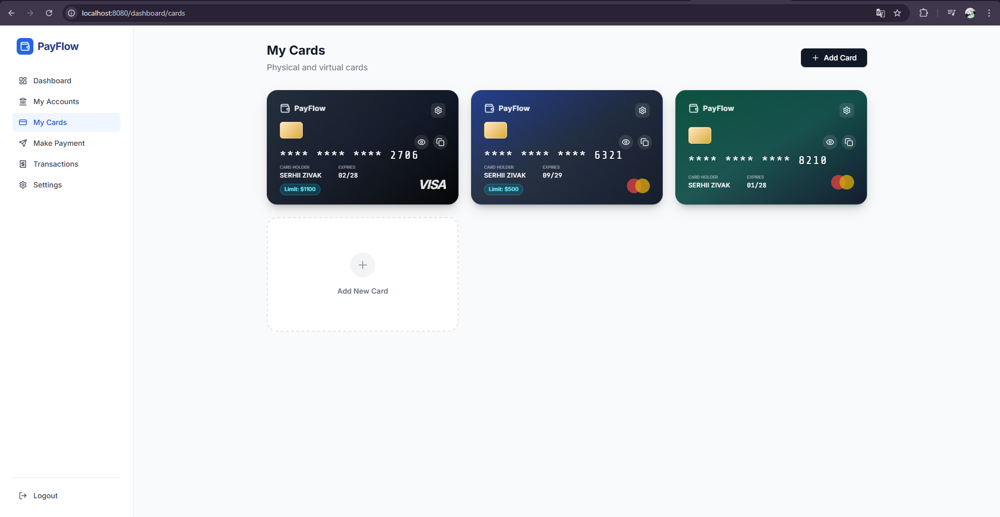 |
|:---:|:---:|
| **Dashboard клієнта** | **Управління картками** |

| 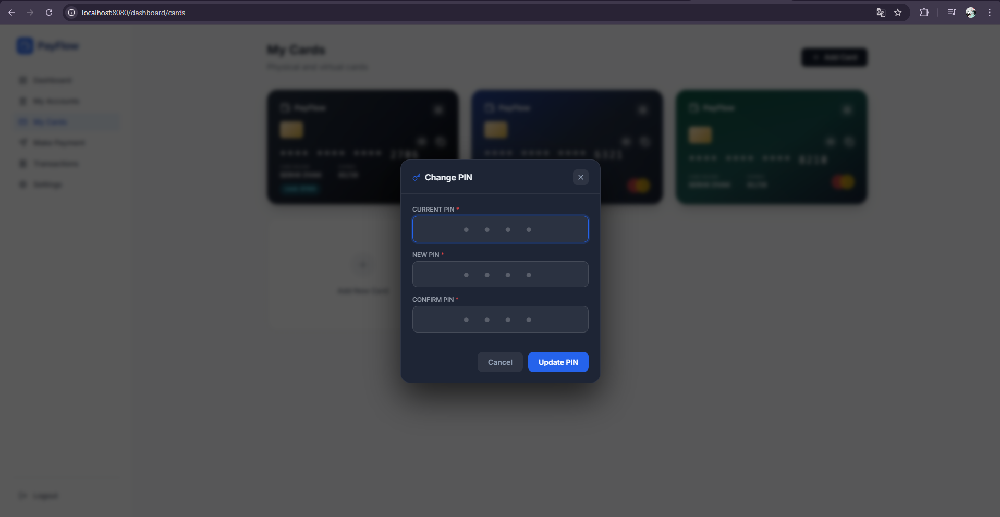 | 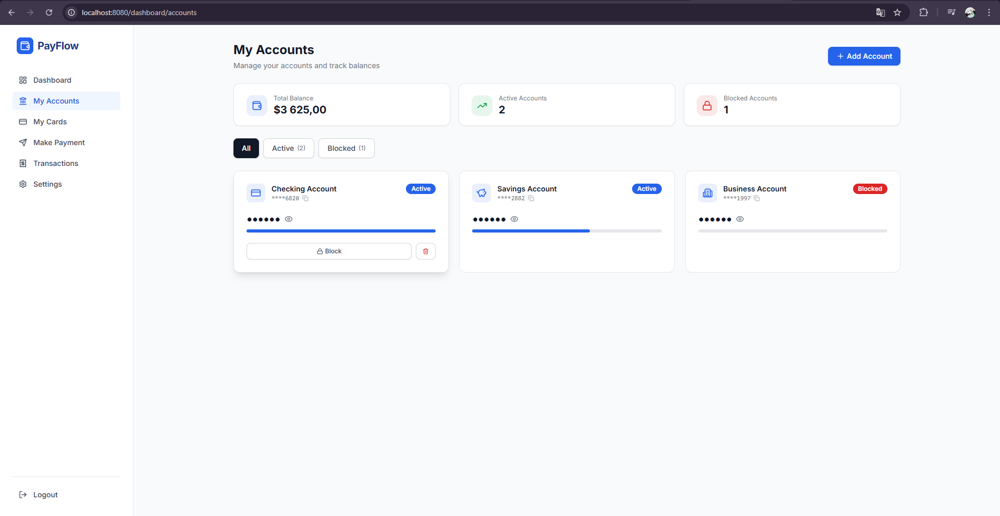 |
|:---:|:---:|
| **Зміна PIN-коду** | **Банківські рахунки** |

| 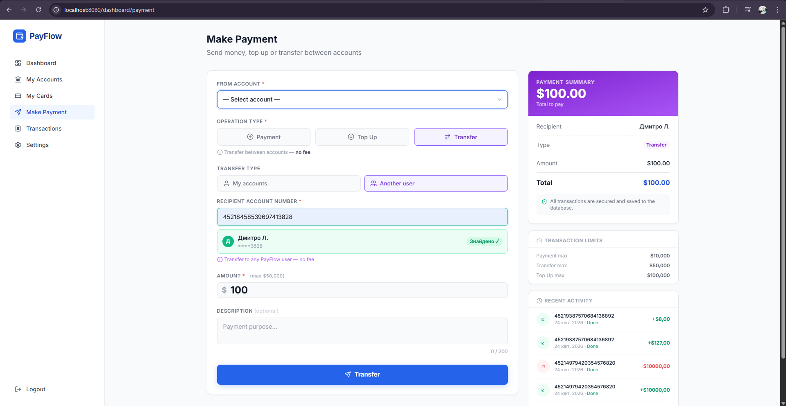 | 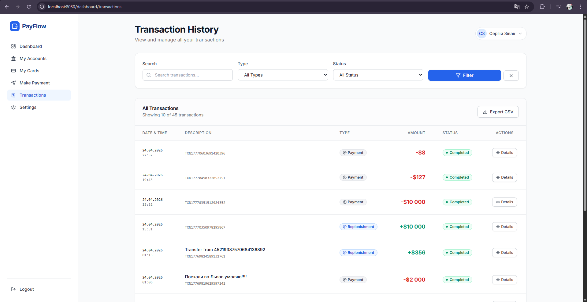 |
|:---:|:---:|
| **Форма платежу** | **Історія транзакцій** |

---

### 🛡️ Адміністратор

Системна панель з керуванням користувачами та повним контролем над транзакціями.

| 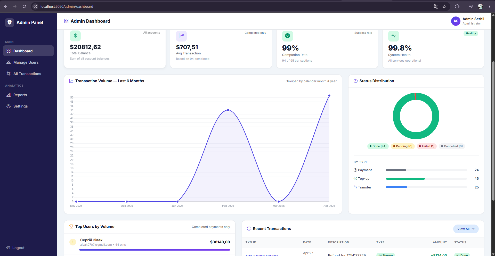 | 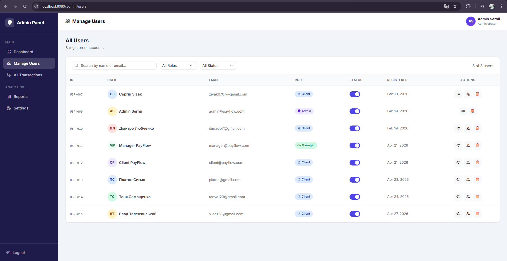 |
|:---:|:---:|
| **Dashboard адміністратора** | **Управління користувачами** |

<p align="center">
  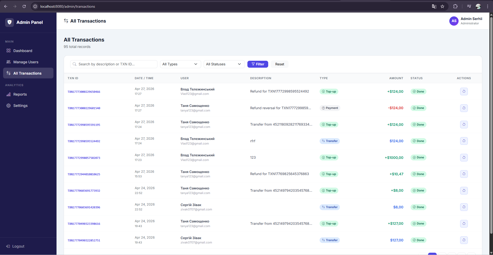
  <br/>
  <b>📋 Управління транзакціями — підтвердження, скасування, refund</b>
</p>

---

### 👔 Менеджер

Панель менеджера з оперативною статистикою та переглядом усіх транзакцій системи.

| 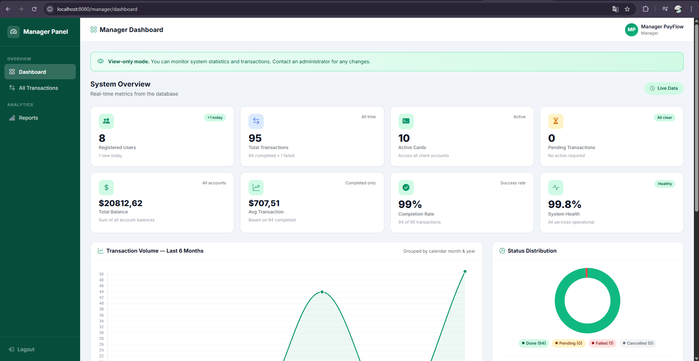 | 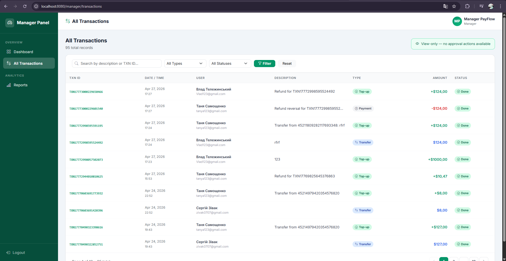 |
|:---:|:---:|
| **Dashboard менеджера** | **Транзакції менеджера** |

---

### 📋 Логування

<p align="center">
  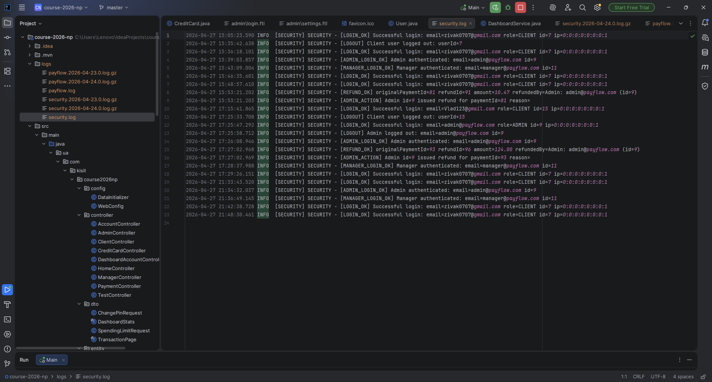
  <br/>
  <b>Файл <code>security.log</code> — аудит подій безпеки</b>
</p>

---

## 📄 Ліцензія

Навчальний проєкт — **Зівак Сергій**, група **371**, 2026
